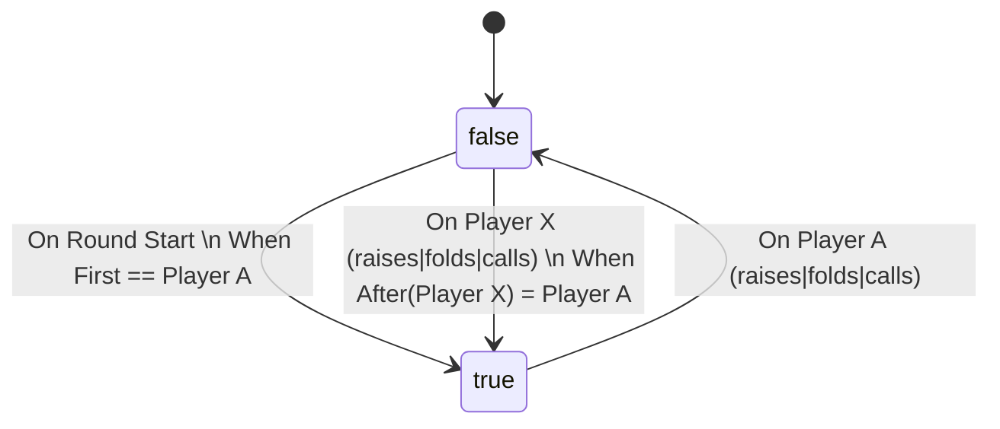
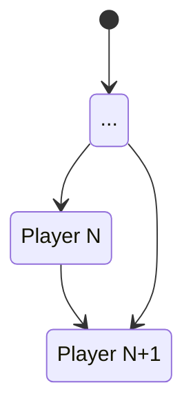

# Server

## Game State Model

So here's the deal: The current state of a poker game definitely depends on a bunch of factors. Basically, actions happen.

A game might look like this:

* Player A joined
* Player B joined
* Player C joined
* Player D joined
* Game began
* Round Began
* Cards dealt
* 3 community cards flipped
* All Players Anted
* Player A called
* Player B called
* Player C called
* Player D called
* 1 community card flipped
* Player A called
* Player B folded
* Player C folded
* Player D raised
* Player A called
* 1 community card flipped
* Player D raised
* Player A raised
* Player D called
* Round ended
* Winner declared: Player D
* Cards collected
...
* Game ended

Current state values are state machines, and so can be calculated as a left-fold over all previous events:
Player A's turn = 

    
A more dynamic script would be:
NextPlayer = f(Players, CurrentPlayer) => {
    i = CurrentPlayer
    do:
        i += 1
    while: Players[i].hasFolded()
    return i
}

How to resolve events changing state, causing events relying on that same state?

Script 1:
    On(A)
    - raise B
    - set X = 1

Script 2: 
    On(B)
    - Print(X)

Approach 1:
    Run as written (depth first)
    * Simple
    * Inefficient?

Approach 2:
    Events build up deltas, which are applied in a separate step.
    * Could be kinda nice
    * More efficient? Maybe?
    * State less tracable? But Not necessarily

Hmmm, how would collision work?
Pre-emptive